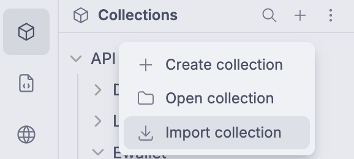

# Importing from Other Clients

ColdBru supports importing collections or API definitions from several other tools and formats into its local file-based model.

## Supported Import Sources

ColdBru currently has import or conversion paths for:

- Bruno and ColdBru collections
- Postman collections
- Postman workspace export ZIP files
- Postman environments
- Insomnia collections
- OpenAPI definitions
- WSDL definitions
- OpenCollection data

## General Import Flow

1. Open ColdBru and create or open the workspace you want to use.
2. Use the relevant import flow to select the source file, export, or definition you want to bring in.
3. Choose where the imported collection should be stored on disk.
4. Review the imported result and make any adjustments needed for your workflow.

### Import Collection Menu

Use the Import Collection Menu to import collections or API definitions from supported sources.

### Import Workspace Menu

Use the Import Workspace Menu when you want ColdBru to create a workspace from a ZIP export.

- This supports ColdBru & Postman workspace export (in ZIP format).
- ColdBru workspace ZIPs restore the workspace directly.
- Postman workspace export ZIPs are converted into a new ColdBru workspace with imported collections and workspace environments.
- Choose the destination folder where ColdBru should create the imported workspace.

## Import Notes by Source

### Bruno

- Bruno-based collections/workspaces are the smoothest to import into ColdBru.
- If you already have local collections/workspaces, you just need use the Open Workspace or Open Collection menu.

### Postman

- Export your Postman collections using [this guideline](https://learning.postman.com/docs/getting-started/importing-and-exporting/exporting-data).
- Import Postman collections into ColdBru by using the [Import Collection Menu](#import-collection-menu).
- Export your full Postman workspace as a ZIP if you want to bring collections and environments together, then import it from the [Import Workspace Menu](#import-workspace-menu).
- Import Postman environments from the environment import flow in ColdBru. Global environments can be imported from the workspace environment screen, and collection environments can be imported from the collection environment UI.

### Insomnia

- Export your Insomnia collections using [this guideline](https://developer.konghq.com/insomnia/import-export/).
- Import Insomnia collections into ColdBru by using the [Import Collection Menu](#import-collection-menu).
- Environments import is not supported yet from the UI. Please check the [Import using Conversion Script](#import-using-conversion-script) section.

### OpenAPI

- Open ColdBru's [Import Collection Menu](#import-collection-menu).
- Upload the OpenAPI file there (or paste the OpenAPI's URL).

### WSDL

- Open ColdBru's [Import Collection Menu](#import-collection-menu).
- Upload the WSDL file there (or paste the WSDL's URL).

## Import using Conversion Script

If you need to import environments or convert many collections in one go, you can use Bruno's converter scripts:

- Package: https://www.npmjs.com/package/@usebruno/converters

This approach is useful when:

- you want to convert environments from sources that are not supported from the ColdBru UI yet
- you want to mass-convert collections from another client into Bruno-compatible files before bringing them into ColdBru

Recommended workflow:

1. Use Bruno's converter script to convert the source collection or environment into Bruno's format.
2. Copy the converted output into your workspace folder, or configure the converter output path to write there directly.
3. Open that workspace in ColdBru so the converted files live inside your normal project structure and Git repository.

For collections, you can also use the `Open Collection` menu after conversion, but this is not the recommended long-term setup because the files may remain outside the workspace's Git folder and will not be tracked by Git as part of that workspace.
