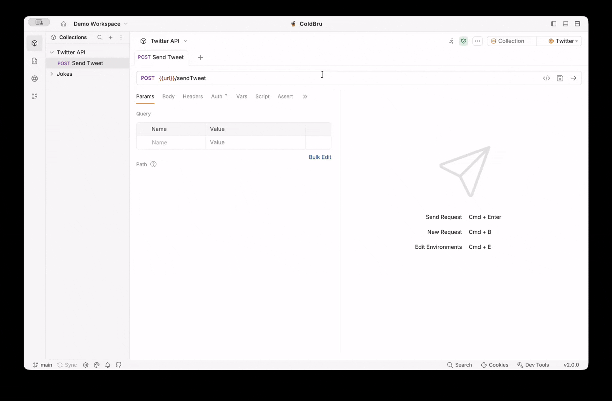

<p align="center">
  
</p>

# ColdBru

> ColdBru is a Bruno-based API client with enhanced navigation, Git tooling, and workspace UX.

<!-- TODO: [](https://github.com/nicandcranny/coldbru/actions/workflows/tests.yml) -->
[](LICENSE.md)
[](https://github.com/nicandcranny/coldbru/releases)

ColdBru is an independent fork of [Bruno](https://github.com/usebruno/bruno), shaped around a more opinionated desktop workflow.
It keeps Bruno's local-first foundation, plain-text collections, and offline-friendly model, while adding UI and workflow changes that make the app feel more like a focused API workbench.

## See It in Action

[](assets/videos/demo.mp4)

[Open the MP4 version](assets/videos/demo.mp4)

## Why ColdBru?

- It stays local-first. Your collections live on disk, not on cloud.
- It leans into navigation and organization, especially when you are juggling lots of requests, specs, and environments.
- It treats Git as part of the workflow instead of an afterthought.
- It is still close enough to upstream Bruno that improvements can continue flowing in over time.

### What Makes It Different?

ColdBru is not a brand-new client built from scratch, and it is not just a thin reskin either.
It is a Bruno fork with product-level changes on top.

### Current Differences from Bruno

- `All` tab group for seeing active tabs in one place.
- Better global search with prefixes like `env:`, `col:`, `req:`, and `spec:`.
- A VS Code-like activity bar for collections, API specs, and global environments.
- A Git menu in the activity bar for Git-focused workflows.
- Global environments treated more like app-wide settings.
- No default "My Workspace" workspace on first launch.
- API specs open in tabs, alongside requests and environments.
- Improved sidebar search for collections, folders, and requests.
- A handful of bug fixes and UX polish.

For more details, see [DIFFERENCES.md](DIFFERENCES.md).

## Support the Project

If this project saves you time, consider buying us a coffee ☕

<a href="https://ko-fi.com/nicandcranny">
  
</a>

## Relationship to Bruno

ColdBru is based on the MIT-licensed open-source [Bruno](https://github.com/usebruno/bruno) project.

Today, ColdBru combines:
- a forked Bruno app and Electron shell with ColdBru-specific UX changes
- upstream `@usebruno/*` packages for a lot of the underlying core functionality

That means the project is best understood as an independent fork with a lighter maintenance layer, not as a plugin and not as a completely unrelated rewrite.

## Importing from Other Clients

ColdBru can import collections and definitions from several other tools and formats, including Bruno, Postman, Insomnia, OpenAPI, and WSDL.

Start with the import guide here:

- [IMPORTING.md](IMPORTING.md)

## Installation

ColdBru is currently distributed through GitHub releases:

- [Download the latest release](https://github.com/nicandcranny/coldbru/releases)

Package manager distribution names for ColdBru are not finalized yet. Until they exist, use the release binaries from GitHub.

## Development

```bash
# install dependencies
npm i --legacy-peer-deps

# start the web app and Electron together
npm run dev
```

Useful commands:

- `npm run dev:web`
- `npm run dev:electron`
- `npm run build:web`
- `npm test --workspace=packages/coldbru-app`
- `npm test --workspace=packages/coldbru-electron`
- `npm run lint:fix`

More setup details live in [CONTRIBUTING.md](CONTRIBUTING.md).

## Attribution

ColdBru would not exist without Bruno.

- Original project: [usebruno/bruno](https://github.com/usebruno/bruno)
- License: [MIT](LICENSE.md)
- Upstream authorship is preserved in the project license and notices.

ColdBru is an independent fork and is not the official Bruno project.

## Branding

**Name**

`ColdBru` is the name of this fork.

**Logo**

The current logo is sourced from [OpenMoji](https://openmoji.org/library/emoji-1F9CB/) under CC [BY-SA 4.0](https://creativecommons.org/licenses/by-sa/4.0/).

## Contributing

Issues, ideas, and pull requests are welcome.

If you want to improve ColdBru, start with:

- [CONTRIBUTING.md](CONTRIBUTING.md)
- [CODING_STANDARDS.md](CODING_STANDARDS.md)

## License

ColdBru is released under the [MIT License](LICENSE.md).

## Future Improvements

- Add more to instant action (like Cmd+Shift+P) - for git, etc.
- Add go to request/environment feature in the Git menu
- CSV runner
